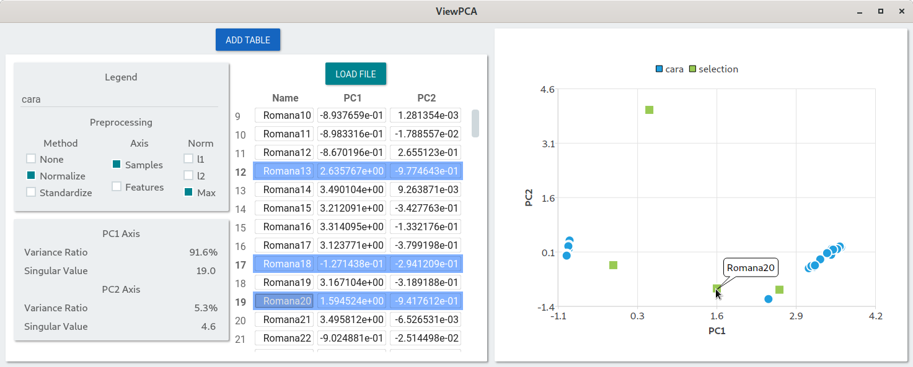

# ViewPCA

This program is used to visualize Principal Componente Analysis(PCA). The input file is a numpy matrix saved in
hdf5 format. this file must have the matrix in a dataset named `pca_matrix` and we also expect the presence of an
attribute named `pca_sample_labels` with the name of each sample(row).
